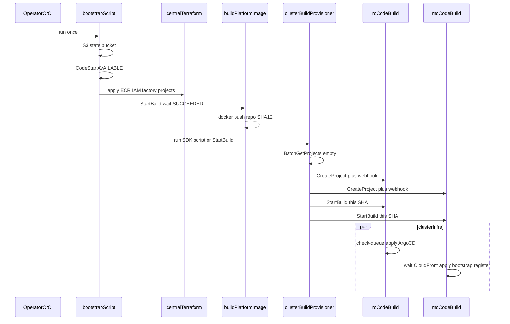
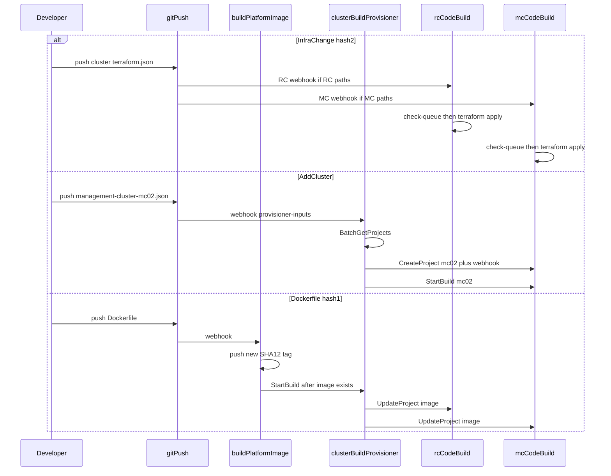
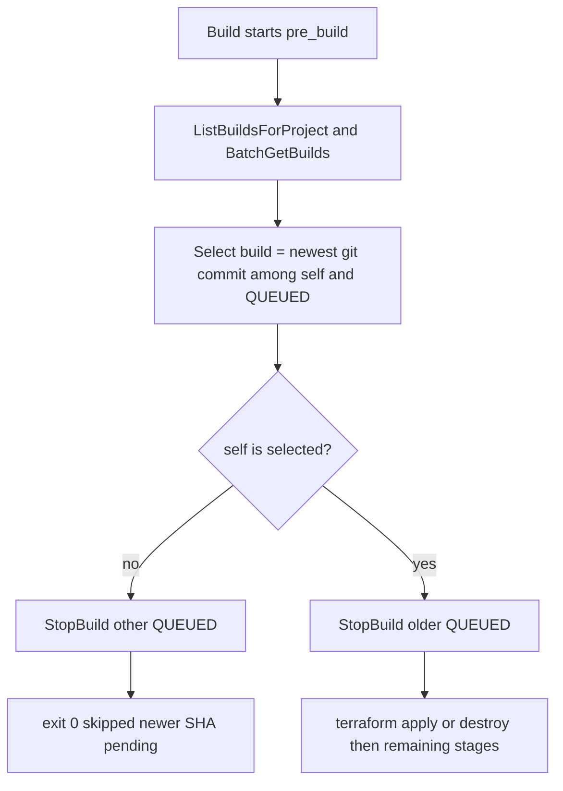

# CodeBuild Provisioning

**Last Updated Date**: 2026-09-23

## Summary

This ADR replaces AWS CodePipeline with standalone AWS CodeBuild for Regional Cluster (RC) and Management Cluster (MC) provisioning. Bootstrap still creates shared central resources (CodeStar, IAM, ECR) plus a thin **cluster-build provisioner** CodeBuild. That provisioner uses the **AWS SDK** (not Terraform state) to create, update, and delete **one CodeBuild project per cluster**. Git webhooks start those projects at the commit SHA.

GitOps (`config/` → `scripts/render.py` → `deploy/` → git push) and terraform for **cluster infrastructure** are unchanged, including **one terraform state object per cluster**. This supersedes the CodePipeline hierarchy in [pipeline-based-lifecycle.md](pipeline-based-lifecycle.md). Concurrency, stacked-commit skipping, and parallel MCs are in [Concurrency and queue behavior](#concurrency-and-queue-behavior).

## Consequences

**Positive:**

- **No CodePipeline meta-layer.** One CodeBuild project per cluster is the lifecycle engine. No S3 artifact buckets, pipeline IAM roles, or stage-to-stage artifact handoff.
- **Skip stale commits.** `check-queue.sh` jumps to the latest SHA with one short skip container instead of N full applies (rapid merges no longer each spend 30-90 min).
- **Fewer AWS resource types** to operate and notify on (CodeBuild + EventBridge only).
- **SDK-managed cluster builds** align with future MC Autoscaler (same `CreateProject`/`UpdateProject`/`DeleteProject` contract). Removes provisioner state locks.

**Negative:**

- **Stage isolation is gone.** Combined buildspec means a bootstrap failure retries the whole job (acceptable: terraform/ArgoCD/Register are idempotent; retry = no-op apply + failed step).
- **Migration cost.** Existing environments require recreation or one-time cutover (no in-place conversion of `CODEPIPELINE` artifacts).
- **Combined timeout budget.** Phases share 90m (RC) / 120m (MC); a slow apply reduces time for bootstrap. Optional elapsed-time check prevents apply from consuming the full budget.

## Context

**Today**

- Three hops: bootstrap → provisioner CodePipeline (`QUEUED`) → terraform-applied RC/MC CodePipelines → CodeBuild (`CODEPIPELINE` artifacts).
- Concurrency control only on provisioner pipeline. Cluster pipelines have no `concurrent_build_limit`; stacked git pushes can overlap applies on the same state.
- MC Deploy polls RC outputs (90×30s, 45 min cap) before plan, including convention-stable values only needed at bootstrap.

**Goals**

- Eliminate CodePipeline. One CodeBuild project per cluster is the lifecycle engine.
- `concurrentBuildLimit: 1` per cluster as the terraform state lock. Skip stale commits via `check-queue.sh`.
- SDK-managed cluster builds (no terraform state for project definitions). Aligns with future MC Autoscaler.

**Design Constraints**

- Keep GitOps (`config/` → render → `deploy/` → git push) and terraform for cluster infra. Keep ECS Fargate private EKS bootstrap.
- CodeStar connection `rosa-regional-github-shared` for git source. Builds in central account, `sts:AssumeRole` to target accounts.
- One terraform state per cluster in target account (unchanged). Cluster CodeBuild project definitions have no state.
- Platform image uses immutable Dockerfile-SHA12 tags (content-addressed). Buildspec scripts unchanged (only how they're invoked changes).
- Two-hash versioning: hash1 = `CreateProject` spec (tag `DefinitionHash`), hash2 = git SHA (`sourceVersion`).

## Alternatives Considered

Rejected: keeping CodePipeline with `QUEUED`/`SUPERSEDED` (doesn't eliminate meta-layer), terraform-managed cluster builds (keeps state locks we want to drop), per-stage CodeBuild projects with chaining (splits the concurrency lock), EventBridge-only queue skipping (running container must check queue), and regional serialization (kills parallel MC provisioning). Chosen: standalone CodeBuild, one project per cluster, SDK provisioner, concurrency 1, `check-queue.sh`.

## Design Rationale

- CodePipeline's job here was Source + ordered CodeBuild + git path filters. CodeBuild CodeConnections source and a single buildspec provide that without a pipeline resource.
- `concurrentBuildLimit: 1` is an AWS project setting ([concurrent build limit](https://docs.aws.amazon.com/codebuild/latest/userguide/create-project.html#enable-concurrent-build-limit.console)). It is the right primitive for terraform locks; CodePipeline `QUEUED` only serialized the **provisioner**, not cluster applies.
- Queue checking belongs **in the buildspec** (`check-queue.sh`) because CodeBuild still starts the next queued container after the current one finishes. Without cancel-and-skip, commits B then C then D each pay full apply time.
- SDK `CreateProject` matches day-2 MC Autoscaler (no terraform apply of pipeline modules in a controller). Phase 1 uses the same API from the provisioner script.
- Two hashes separate "rebuild the builder" (image, env, timeout, webhook filters) from "run this git commit." See [source version](https://docs.aws.amazon.com/codebuild/latest/userguide/sample-source-version.html).
- Combined MC buildspec lets us **stop blocking terraform plan on `rhobs_api_url`**. That value is not consumed by MC terraform modules (it is only re-emitted as an output in `management-cluster/outputs.tf:143`), but today it is a **hard runtime gate** in two scripts: `provision-infra-mc.sh` exits 1 if empty before terraform apply, and `bootstrap-argocd-mc.sh:47-68` polls it for 30 min before ArgoCD bootstrap. The optimization requires **removing the apply-side script gate** (TF doesn't need it); bootstrap already polls it. OIDC bucket/role names are convention-stable (`hypershift-${regional_id}-oidc-${rc_account_id}`). Poll only CloudFront (and any other non-deterministic output) before MC apply. RC and MC projects still **start in parallel**.

## Architecture

### Bootstrap phase

**What bootstrap creates today:**

1. **S3 state bucket** (via bootstrap-state.sh)
2. **CodeStar GitHub connection**
3. **Via terraform** (terraform/config/central-account-bootstrap/main.tf):
   - Platform-image **ECR repository** (module: platform-image)
   - **pipeline-provisioner module** creates:
     - build-platform-image **CodeBuild project** (terraform-managed)
     - pipeline-provisioner **CodePipeline** (terraform-managed, 3 stages)
     - provisioner **CodeBuild project** (terraform-managed)
4. **Provisioner CodePipeline triggers** → provisioner CodeBuild runs terraform → creates RC and MC **CodePipelines** (terraform-managed)

**Key issue:** RC and MC CodePipelines are terraform-managed, creating state lock overhead the team wants to eliminate.

### After this ADR

#### Day 1: Initial Region Provisioning

Bootstrap **invokes** the provisioner script once. Nobody reruns bootstrap until the next env recreate.

**Day 1 phases:**

1. **Terraform** — S3 backend, CodeStar, ECR repo, IAM, `build-platform-image` and `cluster-build-provisioner` projects. No RC/MC projects yet. No EKS.
2. **First image** — `StartBuild` platform-image and wait. The provisioner **fails closed** if `{ecr}:{Dockerfile-SHA12}` is missing (same order as today's image-then-provision pipeline stages).
3. **First run** — bootstrap runs the SDK script (locally or `StartBuild` on `cluster-build-provisioner`): read `deploy/<env>/<region>/pipeline-provisioner-inputs/`, bootstrap target-account infra state buckets and DNS zone terraform, `CreateProject` + webhook for RC and MC01, `StartBuild` at this git SHA.
4. **Cluster jobs in parallel** — RC: `check-queue` → apply → ArgoCD. MC: `check-queue` → CloudFront wait → apply → kube-applier → ArgoCD (`rhobs_api_url` wait) → register. Webhook + `StartBuild` on the same SHA: `check-queue.sh` keeps one winner.

**Two-hash system:**

- **hash1**: SHA-256 of CodeBuild project definition (buildspec path, env vars, image, instance type) — stored as `DefinitionHash` tag on project
- **hash2**: Git commit SHA executed inside the build — passed via webhook or `StartBuild sourceVersion`

Changing cluster terraform/config bumps **hash2** (cluster project webhook). Changing the CodeBuild project spec (image tag, timeout, webhook filters) bumps **hash1** (`cluster-build-provisioner` runs `UpdateProject`).

#### Day 2: Updates (bootstrap is not rerun)

Git webhooks pick the project. The provisioner runs only when the **set of projects** or **hash1** changes.

**Day 2 workflows:**

1. **Infra changes (hash2):** Push `deploy/<env>/<region>/pipeline-regional-cluster-inputs/terraform.json` (or MC equivalent) → that cluster's webhook → `check-queue.sh` → terraform apply. Provisioner does **not** run.
2. **Add a cluster:** Push a new file under `pipeline-provisioner-inputs/` (e.g. `management-cluster-mc02.json`) → `cluster-build-provisioner` → `CreateProject` + webhook + `StartBuild`. Existing RC/MC are not rebuilt unless their spec drifted.
3. **Platform image (hash1):** Push `Dockerfile` → `build-platform-image` pushes a new `:SHA12` tag → provisioner `UpdateProject` on RC/MC so `environment.image` matches. That does not by itself apply cluster terraform. Trigger: provisioner also watches the Dockerfile **or** the image job `StartBuild`s the provisioner after a successful push (same image-then-provision order as today).
4. **Builder spec only:** Change the CreateProject template → provisioner `UpdateProject` (hash1). No cluster terraform unless you also `StartBuild`.
5. **Canary:** Change per-cluster config (not `defaults.yaml`) → render → push → only that cluster's `FILE_PATH` matches → soak → promote in a later commit.
6. **Destroy:** `delete: true` → cluster job terraform destroy; then `delete_pipeline: true` → provisioner `DeleteProject`.

**Note:** MC autoscaling (dynamic `CreateProject` from a controller) is a separate ADR. It uses the same SDK contract as `cluster-build-provisioner`.

**Provisioner logic** (same script on Day 1 from bootstrap and Day 2 from the `cluster-build-provisioner` project):

1. Read `deploy/<env>/<region>/` cluster JSON (same inputs as today)
2. `BatchGetProjects` by name to get existing projects and their `DefinitionHash` tags
3. Compute desired hash1 from config + template
4. `CreateProject` (new cluster) or `UpdateProject` (hash1 drift)
5. `StartBuild` on first create (Day 1 does not wait for git push)
6. After infra destroy: `DeleteProject` when `delete_pipeline` flag set

**Webhook double-start safety:** If `StartBuild` and webhook both fire, `check-queue.sh` (first buildspec step) keeps only the latest SHA winner.

**Webhook quota fallback:** If many ephemeral regions exhaust GitHub webhook quota, use **one dispatcher** CodeBuild with single webhook that `StartBuild`s matching cluster projects with `sourceVersion` (cluster projects then have no webhook).

### One project per cluster and combined buildspecs

| Project                     | `concurrentBuildLimit` | Privileged | Timeout | Buildspec sequence                                                                                                                                                   |
| --------------------------- | ---------------------- | ---------- | ------- | -------------------------------------------------------------------------------------------------------------------------------------------------------------------- |
| `build-platform-image`      | 1                      | yes        | 30m     | [scripts/build-platform-image.sh](../../scripts/build-platform-image.sh)                                                                                             |
| `cluster-build-provisioner` | 1                      | no         | 60m     | `check-queue.sh` → SDK upsert/delete cluster projects; verify platform image tag exists                                                                              |
| `{regional_id}` (RC)        | 1                      | no         | 90m     | `check-queue.sh` → [provision-infra-rc.sh](../../scripts/buildspec/provision-infra-rc.sh) → [bootstrap-argocd-rc.sh](../../scripts/buildspec/bootstrap-argocd-rc.sh) |
| `{management_id}` (MC)      | 1                      | no         | 120m    | `check-queue.sh` → provision-infra-mc (CloudFront wait) → kube-applier-dynamodb → bootstrap-argocd-mc (`rhobs_api_url` wait) → register                              |

Idempotency: terraform apply/destroy, ECS ArgoCD bootstrap, and Register POST are re-runnable from the start of the job. Combined specs keep today's phase-level `on-failure: RETRY-1` (already on every [buildspec](../../terraform/config/pipeline-regional-cluster/buildspec-provision-infra.yml)). Do **not** add project-level `retryLimit` that would start a new build of an already-skipped SHA.

Source type: CodeConnections / GitHub. Artifacts: `NO_ARTIFACTS` (drop pipeline artifact buckets). Destroy override: `StartBuild` environment `IS_DESTROY=true` (replaces CodePipeline variables).

Webhook `FILE_PATH` filters (CodeBuild webhook filter groups, regex-based) stay aligned with today's CodePipeline V2 `trigger…file_paths` include lists (RC: `terraform/config/pipeline-regional-cluster/main.tf:376`, MC: `main.tf:597`, provisioner: `terraform/modules/pipeline-provisioner/main.tf:255`). Paths: RC — `deploy/<env>/<region>/pipeline-regional-cluster-inputs/terraform.json` and RC terraform modules; MC — `deploy/<env>/<region>/pipeline-management-cluster-<id>-inputs/terraform.json` and MC terraform modules; provisioner — `deploy/<env>/*/pipeline-provisioner-inputs/**` and cluster-build definition files; image — Dockerfile and `scripts/build-platform-image.sh`.

### Two-hash versioning

| Hash  | What it versions                                                    | How it changes                                     |
| ----- | ------------------------------------------------------------------- | -------------------------------------------------- |
| hash1 | SHA-256 of CreateProject input; tag `DefinitionHash` on the project | Provisioner `UpdateProject` (later: MC Autoscaler) |
| hash2 | Git commit executed inside the build                                | Webhook / `StartBuild` `sourceVersion`             |

Instance type and other terraform/config changes are **hash2**. Cluster projects reference the platform image by its **immutable Dockerfile-SHA12 tag**. Dockerfile changes produce a new tag; the provisioner updates cluster projects' image references (`UpdateProject` → hash1 change). This ensures clusters always pull the tested image (content-addressed). Provisioner fails closed if the referenced tag is missing.

### Git change rollout (canary, then promote)

**Mechanism:** One CodeBuild project per cluster + `FILE_PATH` filters. Put canary values in per-cluster config (not `defaults.yaml`) → render + push → only that cluster's webhook fires. Soak, then promote in a later commit. `check-queue.sh` is not the orchestrator; soak is the wait between commits.

### Terraform vs SDK split

| Resource                                   | How managed                                                                                                      |
| ------------------------------------------ | ---------------------------------------------------------------------------------------------------------------- |
| CodeStar, central IAM, ECR, shared MC role | Terraform [central-account-bootstrap](../../terraform/config/central-account-bootstrap/)                         |
| Platform-image + provisioner CodeBuild     | Terraform (one-time / env stack), not per cluster                                                                |
| Per-cluster CodeBuild projects             | AWS SDK from the provisioner script                                                                              |
| Cluster infra (EKS, VPC, RDS, …)           | Terraform from inside the cluster CodeBuild                                                                      |
| Infra state                                | Target account, **one object per cluster**: `regional-cluster/${id}.tfstate`, `management-cluster/${id}.tfstate` |
| Cluster CodeBuild definition state         | None (`BatchGetProjects` + `DefinitionHash` tag)                                                                 |

**Drift recovery.** Re-run the provisioner: compare desired spec (from `deploy/` + baked project template) to `BatchGetProjects`; update or create. CloudTrail records SDK calls.

### Destroy and SOP

| What              | How                                                                                      |
| ----------------- | ---------------------------------------------------------------------------------------- |
| Cluster infra     | `delete: true` in config → cluster CodeBuild terraform destroy (same scripts as today)   |
| Cluster CodeBuild | After infra gone: `delete_pipeline: true` → provisioner `DeleteProject`                  |
| SOP rebuild       | `StartBuild` with `IS_DESTROY=true` instead of CodePipeline "Release change" variables   |
| Whole ephemeral   | Destroy MC then RC via cluster builds, `DeleteProject`, then terraform destroy bootstrap |

### Out of this ADR's implementation

- MC Autoscaler adoption/reconcile/capacity (controller is not in this repo).
- Dynamic Grafana CloudWatch datasources and per-MC `PrometheusRemoteWriteHealth_*` when MC count is not known at bootstrap.

## Concurrency and queue behavior

`concurrentBuildLimit: 1` is **per project** (terraform lock for one cluster), not per account. `mc01` ∥ `mc02`; RC ∥ MC. Account quota (20–60, increasable) is a ceiling to alarm on, not a second mutex.

[`check-queue.sh`](../../scripts/pipeline-common/check-queue.sh) is the first command of every combined buildspec. It `StopBuild`s older **QUEUED** builds and **exit 0** if a newer SHA is pending. Winner: `git merge-base --is-ancestor` on `sourceVersion` (unrelated SHAs → higher `buildNumber`). Never stop past `pre_build`. IAM: `ListBuildsForProject` / `BatchGetBuilds` / `StopBuild` **self ARN only**. EventBridge Slack: `FAILED` only.

CI waits for `SUCCEEDED && APPLIED==true && APPLIED_SHA==<desired>` (buildspec `exported-variables`). Ignore skip `SUCCEEDED` and `STOPPED`. Terraform/ECS/Register are re-runnable; unsafe is SIGKILL mid-apply (stale S3 lockfile). Recover `TIMED_OUT`/`FAULT` mid-apply with `terraform force-unlock` after no `IN_PROGRESS` build.

## Implementation plan

Ephemeral first. Standing integration/stage keep today's CodePipeline until a recreate. Provisioner/CodePipeline **code** is deleted after one successful ephemeral path and a documented integration dry-run. Spike git triggers (CodeConnections + `FILE_PATH` webhook, or dispatcher fallback) before rewriting the provisioner.

CodePipeline V2 glob `file_paths` become CodeBuild regex webhook groups (`**` → `.*`, escape `.`, groups OR-ed, add `EVENT: PUSH` and `HEAD_REF`). Paths stay aligned with RC `terraform/config/pipeline-regional-cluster/main.tf:376`, MC `main.tf:597`, provisioner `terraform/modules/pipeline-provisioner/main.tf:255`. Spike two rapid commits. If N webhooks hit GitHub's 20-hook repo cap, use a dispatcher.

1. **This ADR.** Spike notes replaced by this document. Banner on [pipeline-based-lifecycle.md](pipeline-based-lifecycle.md). Index in [docs/README.md](../README.md).
2. **Trigger spike.** One CodeBuild project on the existing CodeStar connection: `NO_ARTIFACTS`, `concurrentBuildLimit: 1`, webhook `PUSH` + branch + `FILE_PATH`, two rapid commits, in-build `StopBuild` of the queued loser. Verify regex filter groups match the intended paths. If N webhooks fail GitHub quota, use a dispatcher.
3. **`check-queue.sh` + combined buildspecs.** Add `scripts/pipeline-common/check-queue.sh`. One RC and one MC buildspec as in the table above. Timeouts 90m / 120m. Unprivileged. Shorten MC CloudFront wait; move `rhobs_api_url` wait to bootstrap.
4. **SDK provisioner.** Replace terraform-of-pipelines in [scripts/provision-pipelines.sh](../../scripts/provision-pipelines.sh) with idempotent `CreateProject` / `UpdateProject` / `DeleteProject` from `deploy/` JSON plus a project spec. Keep DNS zone terraform and state-bucket bootstrap.
5. **Central Terraform.** [terraform/modules/pipeline-provisioner](../../terraform/modules/pipeline-provisioner/): delete `aws_codepipeline`; CodeBuild source → CodeConnections; `concurrent_build_limit = 1`; webhook filters. [pipeline-notifications](../../terraform/modules/pipeline-notifications/): EventBridge `aws.codebuild` `FAILED` only.
6. **Ephemeral CI.** [ci/ephemeral-provider/pipeline.py](../../ci/ephemeral-provider/pipeline.py) / [orchestrator.py](../../ci/ephemeral-provider/orchestrator.py): wait on CodeBuild for the **desired SHA**; ignore skip `SUCCEEDED` and `STOPPED`. Teardown: infra destroy then `DeleteProject`, then bootstrap terraform destroy.
7. **Docs, SOP, cutover.** [environment-provisioning.md](../environment-provisioning.md), [testing-strategy.md](testing-strategy.md), [rebuild-integration.md](../sop/rebuild-integration.md), [FAQ.md](../FAQ.md), [terraform/config/README.md](../../terraform/config/README.md). Recreate integration. `make pre-push`.

## Future optimizations

**MC Autoscaler (day-2).** Controller on the RC (FAQ Management Cluster Reconciler). On startup, adopt CodeBuild projects that have no `ManagementCluster` row. Reconcile hash1 via `UpdateProject`. On capacity need: create CR in `provisioning`, SDK `CreateProject`, `StartBuild`, flip to `ready` when the build succeeds. Same project spec as the provisioner. Unique `management_id` and multi-MC CIDR allocation stay with that work.

**Dynamic RC observability.** `PrometheusRemoteWriteHealth_*` and Grafana `mc-cw-datasources.yaml` today assume a known MC set at bootstrap. Autoscaled MCs need Register/API (or a controller-written ConfigMap) rather than hardcoded cluster ids and account ARNs.

**Cluster-level blue/green** (provision a second RC/MC, shift traffic, destroy the old) — not this ADR. Git canary of terraform changes is in [Git change rollout](#git-change-rollout-canary-then-promote).

**CodeBuild in VPC** — only if a future job must reach private APIs that ECS bootstrap does not cover. Separate ADR amendment.

**Local buildspec testing** using AWS CodeBuild local images, for faster iteration on `check-queue.sh` and combined specs.

Related: [pipeline-based-lifecycle.md](pipeline-based-lifecycle.md), [fully-private-eks-bootstrap.md](fully-private-eks-bootstrap.md), [testing-strategy.md](testing-strategy.md), [environment-provisioning.md](../environment-provisioning.md), [regional-account-minting.md](regional-account-minting.md), [kube-applier-architecture.md](kube-applier-architecture.md).
